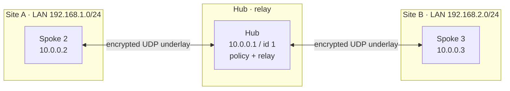
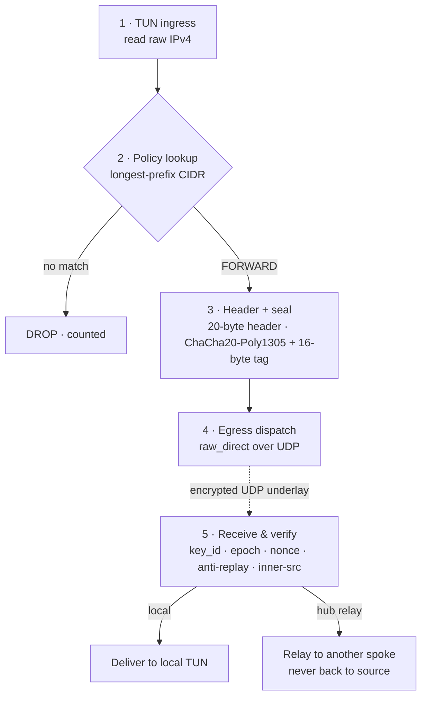

# Architecture

Subnetra is a **Layer-3 overlay**: it moves raw IPv4 packets between nodes over
an encrypted UDP underlay, arranged as a **single-hub hub-and-spoke** star. This
page explains how a packet travels through the system and how the daemon is
structured internally.

## Topology

A central **hub** (typically an overseas relay or colocation node) anchors the
mesh. Each **spoke** (a branch office, a RouterOS container, a Mac) connects to
the hub over a private UDP tunnel. Spokes do not talk to each other directly —
the hub **relays** between them by policy. Together they form a virtual subnet
(e.g. `10.0.0.0/24`) on top of whatever physical leased line connects them, and
can route between LANs behind each node (Site-to-Site).

## The data path

Every packet crosses the same five stages:

1. **TUN ingress.** The kernel routes a LAN/overlay packet to the virtual L3
   device; the reactor reads the raw IPv4 packet non-blocking.
2. **Policy lookup.** The reactor atomically loads the active policy tree and does
   a longest-prefix CIDR match on the destination to decide `FORWARD` (and to
   which peer) or `DROP`.
3. **Header + seal.** It assembles the 20-byte private wire header (version, flags,
   `key_id`, session epoch, sequence number) and encrypts the inner packet with
   ChaCha20-Poly1305, appending the 16-byte tag.
4. **Egress dispatch.** The sealed datagram is sent over the UDP socket to the
   peer's endpoint. v1 uses the `raw_direct` egress; `kcp_arq` / `fec_xor` are
   reserved for v2.
5. **Receive & deliver.** The peer verifies `key_id`, epoch, nonce/anti-replay and
   the inner source, decrypts, and either writes the inner packet to its own TUN
   (LOCAL) or relays it to another spoke (hub only, never back to the source).

## Internal structure

The daemon is a **single-threaded, event-driven reactor**. One thread multiplexes
three file descriptors and never blocks:

| FD | Purpose |
|---|---|
| `TUN_FD` | Raw IPv4 ingress/egress on the virtual L3 device |
| `UDP_FD` | The encrypted underlay socket to/from peers |
| `UDS_FD` | The control-plane Unix domain socket (policy injection, status) |

The readiness primitive is **selected at comptime** by the OS backend:

- **Linux** — `epoll` edge-triggered (`EPOLLET`), reading until `EWOULDBLOCK`.
- **macOS** — `poll(2)` (a spoke-only backend; `kqueue` is a later milestone).

Source modules:

| Module | Responsibility |
|---|---|
| `config.zig` | `config.json` parsing + sanity checks (MTU range, subnet overlap, role rules) |
| `policy.zig` | CIDR parsing, longest-prefix match, lock-free RCU `ActiveTree` |
| `crypto.zig` | ChaCha20-Poly1305, monotonic nonce, sliding-window anti-replay |
| `reactor.zig` | Packed wire header, egress dispatch, the readiness loop |
| `peer.zig` | Per-peer endpoint + crypto registry (keys, counters, replay windows) |
| `os/linux.zig`, `os/darwin.zig`, `os/mod.zig` | Comptime OS backend (epoll + `/dev/net/tun` vs `poll(2)` + `utun`) |
| `uds.zig` | Control socket + command tokenizer |
| `stats.zig` | Data-plane counters (rx/tx, per-reason drops) for `subnetra status` |
| `netplan.zig` | `--print-network-plan` host command emitter |
| `main.zig` / `subnetra.zig` | Daemon entry point / control tool entry point |

## Two memory tiers

Subnetra splits memory by responsibility instead of applying one blanket rule:

- **Data plane (`reactor`, `crypto`): strictly zero allocation.** All packet
  buffers are locked into resident memory at startup via a fixed allocator; the
  hot path never calls `alloc`/`free`. Under a saturating large-packet load the
  RSS line is flat — 0 bytes of jitter.
- **Control plane / reliability (`uds`, policy rebuild, future ARQ/FEC): isolated
  arenas.** These paths may allocate in arenas with independent lifetimes, but
  must never pollute the data-plane memory line.

## Lock-free RCU policy updates

Because the whole daemon is single-threaded, there are **no locks anywhere**. The
data plane reads the policy tree through a single `*const PolicyTree` pointer with
an atomic load. When the control plane injects a rule, it **builds a brand-new
tree** in an arena, then swaps it in with one atomic pointer store (an RCU
pattern). The old tree is reclaimed once the event loop is idle. Hot updates are
therefore zero-copy and jitter-free — an in-flight TCP throughput test sees no
measurable latency spike during a policy swap.

## Endpoint learning (NAT / roaming)

Spokes commonly sit behind NAT with changing public addresses. Subnetra carries
the sender's mesh `id` (`key_id`) in every datagram. When an **authenticated**
packet arrives from a new underlay address, the hub relearns that peer's endpoint
and replies there — no handshake, no restart. This makes NAT remap and roaming
self-healing. A built-in spoke→hub **NAT keepalive** keeps idle pinholes open (see
[Roles](../configuration/roles.md) and [Security Model](security-model.md)).

For the exact byte layout and receiver rules, see the normative
[Wire Protocol](../reference/wire-protocol.md).
