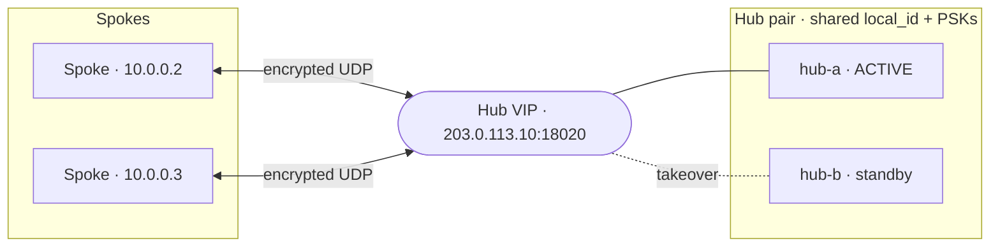

# Production Deployment

This page condenses the full hub + two-spoke production walkthrough. For the
exhaustive version — including traffic shaping, NIC tuning, and benchmarking — see
[`docs/deployment.md`](https://github.com/jamiesun/subnetra/blob/main/docs/deployment.md)
in the repository. Ready-to-edit artifacts live in
[`deploy/`](https://github.com/jamiesun/subnetra/tree/main/deploy)
(`subnetrad.service`, `net.subnetra.subnetrad.plist`, `hub.json`, `spoke-a.json`,
`spoke-b.json`).

## 0. Components

A deployment has one **hub** (stable public UDP endpoint) and one or more
**spokes** (outbound-only, often behind NAT). Each runs the same `subnetrad`
daemon and `subnetra` control tool; the difference is configuration
([Roles](../configuration/roles.md)).

## 1. Install the binary

Use a [release tarball or container image](../getting-started/installation.md). On
a bare host:

```bash
sudo install -m 0755 subnetrad subnetra /usr/local/bin/
```

## 2. Provision config and secrets

Place `config.json` where the service expects it (the units use
`/etc/subnetra/config.json`), owned by root and mode `0600` because it contains
PSKs:

```bash
sudo install -d -m 0750 /etc/subnetra
sudo install -m 0600 hub.json /etc/subnetra/config.json
subnetrad --check --config /etc/subnetra/config.json
# subnetra v… (mtu=…, mode=raw_direct, local_id=…, peers=…) [config ok]
```

Generate each link's PSK with `openssl rand -hex 32` and use a **unique** value per
link. See the [Security Model](../concepts/security-model.md).

## 3. Host networking

The daemon prints — but never applies — the host plan. Review and run it (see
[Host Network Plan](../configuration/network-plan.md)):

```bash
subnetrad --print-network-plan --config /etc/subnetra/config.json
```

## 4. Run as a service

### Linux — systemd

```bash
sudo install -m 0644 deploy/subnetrad.service /etc/systemd/system/subnetrad.service
sudo systemctl daemon-reload
sudo systemctl enable --now subnetrad
journalctl -u subnetrad -f
```

The unit requests only `CAP_NET_ADMIN`, grants `/dev/net/tun`, runs
`subnetrad --check` as `ExecStartPre`, restarts on failure, and is otherwise
sandboxed (`ProtectSystem=strict`, `NoNewPrivileges`, restricted address families).
Edit the commented `ExecStartPost` lines to match your `--print-network-plan`
output.

### macOS — launchd

A macOS **spoke** runs as a system daemon (creating a `utun` needs root):

```bash
sudo install -m 0644 deploy/net.subnetra.subnetrad.plist \
    /Library/LaunchDaemons/net.subnetra.subnetrad.plist
sudo launchctl bootstrap system /Library/LaunchDaemons/net.subnetra.subnetrad.plist
sudo launchctl enable system/net.subnetra.subnetrad
sudo tail -f /var/log/subnetrad.log
# subnetra v… (… mode=raw_direct …) tun=utun4 sock=/var/run/subnetra.sock [ready]
```

The `utunN` name is kernel-assigned — read it from the `[ready]` banner and apply
the plan **after** the daemon is up. See the [macOS Spoke](macos-spoke.md) guide.

## 5. Install the relay policy (hub)

> **Shortcut:** if your config sets `"role": "hub"` / `"spoke"`, the daemon
> **derives this whole policy at boot** and you can skip this section. See
> [Roles](../configuration/roles.md).

For `role=manual`, install the relay/delivery rules at runtime over the control
socket (hot-swapped, no restart). On Linux the CLI default already matches the
daemon, so no `SUBNETRA_SOCK` is needed (set it only for a custom path):

```bash
# Hub: relay overlay traffic to the right spoke
sudo -E subnetra policy add --src 0.0.0.0/0 --dst 10.0.0.2/32 --action forward --target 2
sudo -E subnetra policy add --src 0.0.0.0/0 --dst 10.0.0.3/32 --action forward --target 3
sudo -E subnetra policy show
sudo -E subnetra save        # persist a replayable snapshot

# Spoke: deliver tunnelled traffic for the local overlay address to the local TUN (target 0)
sudo -E subnetra policy add --src 0.0.0.0/0 --dst 10.0.0.2/32 --action forward --target 0
```

## 6. Operate

`subnetra status` shows peers, traffic, and per-reason drops; `--json` is the
stable schema for monitoring. See
[Observability & Troubleshooting](observability.md).

## 7. Firewall / NAT

- The **hub** must accept inbound UDP on all configured `listen_ports` from the
  internet. The default is the explicit set `18020, 18023, 18026` (not a range),
  avoiding WireGuard's well-known port fingerprint and keeping the node reachable
  if one port is blocked or throttled.
- Each **spoke** needs only **outbound** UDP reachability to the hub — no inbound
  port-forwarding (the spoke initiates). A spoke therefore only needs **one**
  listen port (the role-aware default binds just `[18020]`); multiple
  `listen_ports` are a hub-side feature, because the hub is the reachable endpoint
  that spokes target.
- If a spoke's NAT mapping changes, the hub re-learns its new endpoint from the
  next authenticated datagram. Keep the **hub** endpoint stable; spokes always
  initiate.

### NAT keepalive (built-in)

An idle spoke's NAT mapping times out (often ~30 s for UDP), after which inbound
relays would blackhole. A `role=spoke` runs a **built-in keepalive** by default
(`keepalive_secs = 20`): one tiny authenticated datagram per interval holds the
pinhole open and keeps the hub's learned endpoint fresh. It is allocation-free and
adds no thread or external process. Confirm it with the `keepalive tx` / `keepalive
rx` counters. Set `keepalive_secs = 0` to disable (e.g. a spoke not behind NAT).

### Hub on a dynamic IP (DDNS)

Endpoints are numeric `IP:port` and endpoint learning is one-way — a spoke cannot
discover a hub that moved. Prefer a **stable public IP** for the hub. If you must
run it behind a dynamic address, solve it operationally on each spoke with a small
DDNS watcher that rewrites the endpoint and restarts the (stateless) daemon — no
daemon changes.

### Hub behind NAT (static port-forward)

A hub does not need a public-IP box — it needs a **stable, inbound-reachable UDP
endpoint**. A host behind NAT qualifies if the edge router has **static
port-forwards (DNAT)** from fixed public UDP ports to the hub's internal
`IP:listen_ports`:

- **Spokes dial the _external_ address.** Each spoke's peer `endpoint` is one public
  `IP:port` from the forward (typically the primary `:18020`), not the hub's private
  address.
- **`listen_ports` are the _internal_ targets.** Forward each configured UDP port
  (for the default, public `18020/18023/18026` → internal `18020/18023/18026`). The
  singular `listen_port` remains a back-compat alias for a one-port deployment and
  is ignored when `listen_ports` is present.
- **The mapping must be static.** A fixed port-forward, not dynamic PAT that rewrites
  the source port per flow. If the public IP itself also changes, combine this with the
  DDNS approach above.
- **Same-LAN spokes need the internal endpoint (hairpin).** A spoke *inside the same
  NAT* often cannot reach the hub through the public IP unless the router does NAT
  hairpin/loopback — give those spokes the hub's internal primary `IP:port` instead.
- **CGNAT cannot host a hub.** If the "public" address is itself carrier-grade NAT with
  no inbound port control, you cannot forward to it; that host can only be a spoke.

This is still an ordinary **single hub** — only its reachability is via DNAT — so it
stays inside the validated single-tier model. Endpoint learning remains one-way: keep
the external mapping stable; spokes always initiate.

## 8. High availability

v1 is **single-hub** by design. The data plane is single-path, stateless, and
handshake-free, and the daemon **never probes peer health or auto-switches paths**
(an [explicit non-goal](../reference/roadmap.md#explicit-non-goals)). Multi-hub and
failover are therefore built *around* the daemon with ordinary config + OS tooling,
driven by the **observe-only** health in `subnetra status --json` (`online`,
`last_seen_age_seconds`, a flat `auth_or_invalid`). Two patterns are sanctioned.

### Pattern A — active/standby hub VIP (recommended)

Two hub boxes sit behind one VRRP/`keepalived` VIP (or an anycast prefix). They
share **identical** config — same `local_id`, same per-spoke PSKs, same derived
policy — so every spoke sees exactly **one** peer (the VIP) and needs **no special
config**: a normal `role=spoke` pointing at the VIP as its single hub.



Minimal `keepalived` on each hub box, with a notify hook that **restarts** the
daemon on takeover:

```conf
vrrp_instance subnetra {
    state BACKUP            # BACKUP + nopreempt on both avoids needless flaps
    interface eth0
    virtual_router_id 51
    priority 150            # 150 on hub-a, 100 on hub-b
    nopreempt
    advert_int 1
    virtual_ipaddress { 203.0.113.10/32 }
    notify_master "/usr/local/sbin/subnetra-takeover.sh"
}
```

```bash
# /usr/local/sbin/subnetra-takeover.sh  — runs when this box wins the VIP.
#!/bin/sh
# Restart so the daemon samples a FRESH boot epoch above the old active's (see below).
systemctl restart subnetrad
```

Two caveats are load-bearing:

- **Epoch ordering (the #1 gotcha).** Every datagram carries the sender's *boot
  epoch* (wall-clock ns at start) and receivers are **forward-only**: a session
  whose epoch is *lower* than the one a spoke already accepted is dropped **before
  crypto** until wall-clock passes it. A long-idle standby that booted *before* the
  active presents a *lower* epoch and is silently blackholed. Mitigation: keep
  **both hubs on NTP** and **restart the daemon at takeover** (the `notify_master`
  hook) so it stamps a fresh, higher epoch. This is exactly why active/standby beats
  active/active here.
- **Endpoint re-learn window.** Endpoint learning is one-way, so the new active
  starts with **no** learned spoke endpoints: hub→spoke *relay* blackholes until each
  spoke's next keepalive re-teaches it (spoke→hub works immediately — the spoke
  initiates). Recovery is bounded by `keepalive_secs` (spoke default `20`); lower it
  on the spokes for faster failover.

### Pattern B — static dual-hub (independent identities)

Two **fully independent** hubs — distinct `local_id`, distinct PSKs, no shared
secrets and no epoch coupling — both relaying the same overlay. Every spoke is a
peer of **both** and keeps a primary; you switch by editing the spoke's policy.
This also enables **locality**: point regional prefixes at the in-region hub so only
cross-region destinations traverse a long-haul link (each regional hub must carry
the spokes you want locally reachable).

Because `role=spoke` validates **exactly one hub peer**, a two-hub spoke runs
`role=manual` and installs its own longest-prefix policy over the control socket:

```bash
# Primary path: the whole overlay via hub-1 (id 1); local delivery for self.
sudo -E subnetra policy add --src 0.0.0.0/0 --dst 10.0.0.0/24 --action forward --target 1
sudo -E subnetra policy add --src 0.0.0.0/0 --dst 10.0.0.5/32 --action forward --target 0
sudo -E subnetra policy show
sudo -E subnetra save

# Fail the overlay over to hub-2 (id 2): two /25s out-specify the /24 (longest
# prefix wins), diverting all overlay traffic without touching the /24 rule.
sudo -E subnetra policy add --src 0.0.0.0/0 --dst 10.0.0.0/25   --action forward --target 2
sudo -E subnetra policy add --src 0.0.0.0/0 --dst 10.0.0.128/25 --action forward --target 2
```

Keep the two hubs' prefixes **non-overlapping** when load-splitting — the same
discipline `role=hub` enforces on `allowed_src` — to avoid split-brain (two relays
claiming one destination).

> **No live `policy replace`.** The control socket is **append-only**
> (`policy add` / `policy show` / `save` — there is no `replace`, `del`, or
> `clear`), and longest-prefix only lets a *more specific* rule win. To **move** a
> prefix you therefore either (a) **restart the spoke daemon** with an updated
> config/snapshot — it is stateless, so a restart costs only the keepalive re-learn
> window — or (b) push a more-specific **override** as above (the table grows; a
> clean revert still needs a restart). Design the split to be **mostly static**; do
> not treat Pattern B as sub-second failover.

### Choosing a pattern

| | Pattern A — VIP | Pattern B — static dual-hub |
|---|---|---|
| Goal | Availability (one logical hub) | Locality + availability (two regions) |
| Spoke config | Unchanged (`role=spoke`, one peer) | `role=manual`, both hubs, manual policy |
| Hub identity | **Shared** `local_id` + PSKs | **Distinct** `local_id` + PSKs |
| Switch trigger | Network (VRRP), seconds | Operator restart / prefix override |
| Main gotcha | Epoch ordering + re-learn window | No live `replace`; keep splits static |
| Anycast | Possible, but riskier than VRRP (a mid-flow POP move churns endpoint learning) | n/a |

> **Key-material note (Pattern A).** Sharing `local_id` + PSKs puts identical
> secrets on two boxes — secure both to the same standard; a compromise of either is
> a compromise of every spoke link. The daemon itself makes **no** failover
> decision in either pattern.

## 9. Traffic shaping & tuning

On long cross-ISP links the dominant cause of jitter/loss is the **underlay**, not
detection. All shaping is done at the OS layer with `tc` — no daemon or protocol
changes. Cap your egress to ~60–80% of the link's *stable* throughput, smooth
bursts, and (optionally) tune socket buffers and IRQ/CPU affinity. The kernel sees
the real inner five-tuples on the cleartext `snr0` device. See
[`docs/deployment.md` §9–§10](https://github.com/jamiesun/subnetra/blob/main/docs/deployment.md)
for the full recipes and the live-overlay benchmark.
