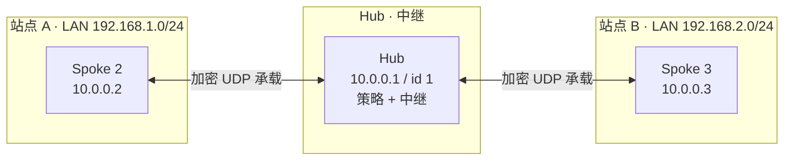
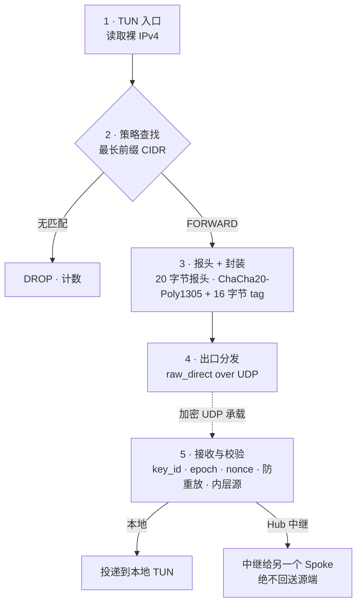

# 架构

Subnetra 是一个 **三层叠加网（Layer-3 overlay）**：它在加密的 UDP 承载之上、以
**单 Hub 星型（Hub-and-Spoke）** 结构在节点间搬运裸 IPv4 包。本页讲解一个包如何穿越
系统，以及守护进程内部如何组织。

## 拓扑

一个中心 **Hub**（通常是海外中继或托管节点）锚定整个网格。每个 **Spoke**（分支办公室、
RouterOS 容器、Mac）通过私有 UDP 隧道连接到 Hub。Spoke 之间不直接通信——由 Hub 按策略
在它们之间 **中继**。它们共同在物理专线之上构成一个虚拟子网（例如 `10.0.0.0/24`），
并可在各节点背后的局域网之间路由（Site-to-Site）。

## 数据通路

每个包都经过相同的五个阶段：

1. **TUN 入口。** 内核把局域网/叠加网的包路由到虚拟三层网卡；反应堆非阻塞地读取裸
   IPv4 包。
2. **策略查找。** 反应堆原子加载生效的策略树，对目的地址做最长前缀 CIDR 匹配，决定
   `FORWARD`（转发给哪个对端）或 `DROP`。
3. **报头 + 封装。** 组装 20 字节私有线报头（版本、flags、`key_id`、会话 epoch、序号），
   用 ChaCha20-Poly1305 加密内层包并追加 16 字节认证标签。
4. **出口分发。** 封装后的数据报经 UDP 套接字发往对端 endpoint。v1 使用 `raw_direct`
   出口；`kcp_arq` / `fec_xor` 为 v2 预留。
5. **接收与投递。** 对端校验 `key_id`、epoch、nonce/防重放与内层源地址，解密后，要么把
   内层包写入自己的 TUN（LOCAL），要么中继给另一个 Spoke（仅 Hub，绝不回送源端）。

## 内部结构

守护进程是一个 **单线程、事件驱动的反应堆**。单线程复用三个文件描述符，永不阻塞：

| FD | 用途 |
|---|---|
| `TUN_FD` | 虚拟三层网卡上的裸 IPv4 入口/出口 |
| `UDP_FD` | 与对端往返的加密承载套接字 |
| `UDS_FD` | 控制面 Unix 域套接字（策略注入、状态查询） |

就绪原语由 OS 后端在 **comptime 选择**：

- **Linux**——`epoll` 边缘触发（`EPOLLET`），读取直到 `EWOULDBLOCK`。
- **macOS**——`poll(2)`（仅 Spoke 后端；`kqueue` 是后续里程碑）。

源码模块：

| 模块 | 职责 |
|---|---|
| `config.zig` | `config.json` 解析 + 防呆自检（MTU 区间、子网重叠、角色规则） |
| `policy.zig` | CIDR 解析、最长前缀匹配、无锁 RCU `ActiveTree` |
| `crypto.zig` | ChaCha20-Poly1305、单调 nonce、滑动窗口防重放 |
| `reactor.zig` | packed 线报头、出口分发、就绪循环 |
| `peer.zig` | 每对端 endpoint + 加密注册表（密钥、计数器、重放窗口） |
| `os/linux.zig`、`os/darwin.zig`、`os/mod.zig` | comptime OS 后端（epoll + `/dev/net/tun` 对 `poll(2)` + `utun`） |
| `uds.zig` | 控制套接字 + 指令分词器 |
| `stats.zig` | 数据面计数（rx/tx、按原因分类的 drop），供 `subnetra status` 使用 |
| `netplan.zig` | `--print-network-plan` 主机命令生成器 |
| `main.zig` / `subnetra.zig` | 守护进程入口 / 控制工具入口 |

## 两层内存分级

Subnetra 按职责对内存分级，而非套用一条统一规则：

- **数据面（`reactor`、`crypto`）：严格零分配。** 所有包缓冲区在启动时通过固定分配器
  锁死在常驻内存；热路径绝不调用 `alloc`/`free`。在饱和的大包负载下 RSS 曲线是平的——
  0 字节抖动。
- **控制面 / 可靠性（`uds`、策略重建、未来的 ARQ/FEC）：隔离 arena。** 这些路径可在拥有
  独立生命周期的 arena 中分配，但绝不能污染数据面的内存曲线。

## 无锁 RCU 策略更新

由于整个守护进程单线程，所以 **任何地方都没有锁**。数据面通过单个 `*const PolicyTree`
指针、以原子加载读取策略树。当控制面注入一条规则时，它在 arena 中 **构建一棵全新的树**，
然后用一次原子指针写入将其换上（RCU 模式）。旧树在事件循环空闲后回收。因此热更新零拷贝、
零抖动——一个进行中的 TCP 吞吐测试在策略切换期间观测不到可测的延迟尖刺。

## Endpoint 学习（NAT / 漫游）

Spoke 通常位于 NAT 之后，公网地址会变。Subnetra 在每个数据报里携带发送方的网格 `id`
（`key_id`）。当一个 **已认证** 的包从新的承载地址到达时，Hub 会重新学习该对端的
endpoint 并回复到那里——无握手、无重启。这使 NAT 重映射与漫游自愈。内置的 spoke→hub
**NAT 保活** 让空闲的 NAT 孔保持打开（见 [角色](../configuration/roles.md) 与
[安全模型](security-model.md)）。

精确的字节布局与接收方规则，见规范 [线协议](../reference/wire-protocol.md)。
