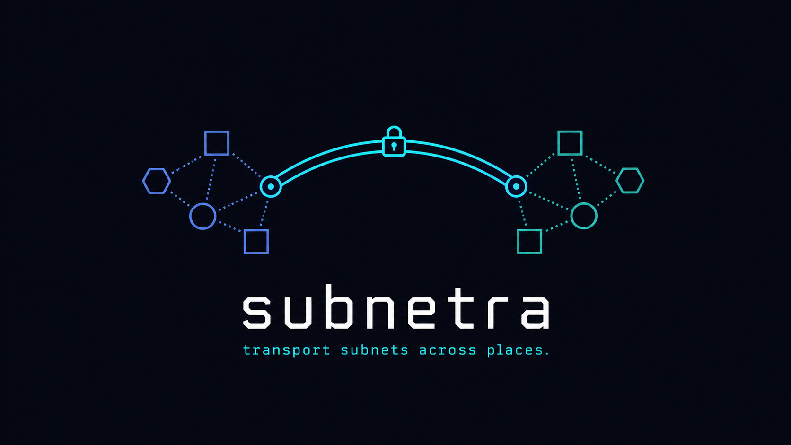

<p align="center">
  
</p>

# 简介

**把你的服务器、站点和设备连接成一张私有的加密网络——只需一个随处可跑的小巧二进制文件，从云主机到 MikroTik 路由器都能部署。**

> 本文档站点为中英双语。使用顶栏的 **中文 / EN** 开关切换语言，或阅读
> [English documentation](https://jamiesun.github.io/subnetra/en/)。

## Subnetra 是什么？

Subnetra 把分散在不同地点的机器——分支办公室、数据中心、移动办公的笔记本、家庭实验室、
容器、路由器——连接成**一张扁平的私有子网**。

它采用**星型拓扑（Hub-and-Spoke）**：一个可达的 **Hub** 在各个 **Spoke** 之间中继流量，
于是任意节点都能用一个固定的虚拟 IP 访问其他任意节点——**哪怕大多数节点都藏在 NAT 后面**。
每个数据包都在普通的 UDP 隧道里**全程加密**传输，而整套东西就是**一个自包含的二进制文件**——
无需额外安装任何东西，没有内核模块，也没有一堆守护进程。

## 你能用它做什么

- 🏢 **打通分支办公室与数据中心**——在一张私有 overlay 上做站点到站点（site-to-site）的整段子网路由。
- 💻 **给移动办公的笔记本一个固定私有 IP**——它会随你在 Wi-Fi、4G/5G、家庭网络之间漫游而保持不变。
- 🧪 **访问家庭实验室 / IoT / 容器里的服务**——就像它们和你在同一个局域网里一样。
- 🛰 **从 NAT 后面对外发布一整段局域网**——例如让 MikroTik 路由器把 `192.168.88.0/24` 暴露给整张网。
- 📦 **在塞不下重型 VPN 的地方运行**——资源受限的容器、BusyBox、小型 ARM 设备、边缘路由器。

## 核心亮点

- **随处可跑，一个文件即装**——单个静态二进制（Linux 下**小于 512KB**），**零外部依赖**。
  可直接丢进云主机、容器、BusyBox、树莓派以及 **MikroTik RouterOS**。支持
  `amd64` / `arm64` / `armv7` / `armv5`，外加一个原生 **macOS** Spoke。
- **默认加密，链路上低特征**——每个包都用 ChaCha20-Poly1305 加密，**每条链路独立密钥**，
  带**防重放**。没有任何特征字（magic bytes），未通过认证的包会被**静默丢弃**——在端口扫描器
  看来，这个隧道就像没有任何东西在监听。**报头混淆默认开启**（`obfuscate`，需全 mesh 一致）：
  20 字节封装报头按包做 XOR 掩码，使整个数据报看起来像随机字节，NAT 保活节奏也被去周期化——
  *被动*观察者拿不到协议指纹。设 `"obfuscate": false` 可改发可读的明文报头（例如抓包调试）。
  混淆隐藏的是协议指纹，而非包长或时序。见
  [线协议 → 报头混淆](reference/wire-protocol.md#报头混淆可选)。
- **一张带策略路由的扁平私有子网**——给每个节点分配一个 overlay IP，按整段子网做站点到站点路由，
  并由 Hub 做 **Spoke 到 Spoke** 的中继，让 NAT 后的节点也能互相访问。
- **天生穿透 NAT**——Spoke 通过**内置保活（keepalive）**维持自己的 NAT 映射，
  Hub 则会在 Spoke 漫游到新地址时**自动重新学习**它的端点——无需外部 ping 脚本，无需手动重连。
- **路由可热改**——运行时注入或更新转发规则，**零中断**：不重启、不丢包。
- **为运维而生**——同时提供人类可读**和** JSON 两种状态输出、按原因细分的丢包计数器
  （告诉你流量*为什么*没通）、每个对端的健康/`online` 标志，以及用于告警的 **Prometheus** 导出器。
- **简单的声明式配置**——把一个节点声明成 `hub` 或 `spoke`，转发表会自动推导出来。
  还能给对端起名字，让 `status` 里显示的是 `bj-office-gw`，而不是 `id=2`。

## 快速上手

最快的方式是用容器镜像（Hub 通常是一台公网云主机）：

```bash
# 1. 创建配置——一个 Hub，一个或多个 Spoke。
cp config.example.json config.json
#    给每条对端链路设置一把唯一的 64 位十六进制密钥：openssl rand -hex 32

# 2. 运行（隧道需要 TUN 设备 + NET_ADMIN）。
docker run -d --name subnetra \
    --cap-add=NET_ADMIN --device=/dev/net/tun \
    -v "$PWD/config.json":/etc/subnetra/config.json:ro \
    ghcr.io/jamiesun/subnetra:latest

# 3. 查看状态。
docker exec subnetra subnetra status
```

更喜欢裸二进制？从[最新发布](https://github.com/jamiesun/subnetra/releases/latest)
下载对应架构的静态构建，然后跟随 **[安装](getting-started/installation.md)** 与
**[快速上手](getting-started/quickstart.md)** 指南。完整的「一个 Hub + 两个 Spoke」
生产部署演练见 **[生产部署](operations/deployment.md)**。

## 运维与可观测

`subnetra status` 把那些「设计上静默丢弃」的包变成可计数的信号，
让你能判断流量*为什么*通或不通：

```text
subnetra v0.6.0 [running]
mode=raw_direct local_id=1 udp_port=18020 tun=snr0 peers=2
peers:
  id=2 name=bj-office-gw endpoint=203.0.113.2:18020 allowed_src=10.0.0.2/32
  id=3 name=alice-laptop endpoint=203.0.113.3:18020 allowed_src=10.0.0.3/32
traffic: tun_rx / udp_tx / udp_rx / tun_tx / relay / keepalive …
drops:   unknown_peer / auth_or_invalid / spoof / no_route …
```

`subnetra status --json` 把同样的数据输出为一个稳定、带版本号的 JSON 对象——其中包含每个
对端的 `last_seen_age_seconds` 和 `online` 标志——配合开箱即用的 **Prometheus** 导出器即可
变成可抓取的指标。完整的状态字段、丢包分类和告警示例见
**[可观测性与排障](operations/observability.md)**。

## 如何阅读本文档

- 初次接触？从 **[安装](getting-started/installation.md)** 与
  **[快速上手](getting-started/quickstart.md)** 开始。
- 想理解设计？阅读 **[架构](concepts/architecture.md)** 与
  **[安全模型](concepts/security-model.md)**。
- 在写配置？查看 **[配置参考](configuration/reference.md)** 与
  **[角色](configuration/roles.md)**。
- 要上生产？跟随 **[生产部署](operations/deployment.md)**、**[容器](operations/containers.md)**、
  **[RouterOS Spoke](operations/routeros.md)** 或 **[macOS Spoke](operations/macos-spoke.md)** runbook。
- 要做另一套实现？**[线协议](reference/wire-protocol.md)** 是规范契约。

## 项目状态

框架层、纯算法层与系统调用数据通路（TUN、就绪反应堆、AF_UNIX 控制面、守护进程主
循环）均已实现，并在开发容器中端到端跑通；macOS 原生 `utun`/`poll(2)` Spoke 由
comptime 的 `src/os/` 后端支撑。v1（`raw_direct` + PSK + 防重放 + RCU 策略）即交付物；
v2 可靠性模式（`kcp_arq`、`fec_xor`）仅为预留接口点——见
**[路线图](reference/roadmap.md)**。

## 许可证

[MIT](https://github.com/jamiesun/subnetra/blob/main/LICENSE) © 2026 jettwang。
