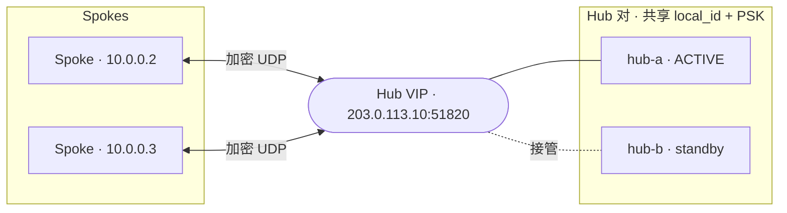

# 生产部署

本页浓缩了完整的 Hub + 双 Spoke 生产演练。详尽版本——含流量整形、网卡调优与基准测试——
见仓库中的
[`docs/deployment.zh-CN.md`](https://github.com/jamiesun/subnetra/blob/main/docs/deployment.zh-CN.md)。
可直接编辑的产物位于
[`deploy/`](https://github.com/jamiesun/subnetra/tree/main/deploy)
（`subnetrad.service`、`net.subnetra.subnetrad.plist`、`hub.json`、`spoke-a.json`、
`spoke-b.json`）。

## 0. 组件

一次部署有一个 **Hub**（稳定的公网 UDP 端点）和一个或多个 **Spoke**（仅出站，常位于 NAT
之后）。它们运行相同的 `subnetrad` 守护进程与 `subnetra` 控制工具；区别在配置
（[角色](../configuration/roles.md)）。

## 1. 安装二进制

使用[发布 tar 包或容器镜像](../getting-started/installation.md)。在裸主机上：

```bash
sudo install -m 0755 subnetrad subnetra /usr/local/bin/
```

## 2. 准备配置与密钥

把 `config.json` 放到服务期望的位置（单元使用 `/etc/subnetra/config.json`），属主 root、
权限 `0600`，因为它含有 PSK：

```bash
sudo install -d -m 0750 /etc/subnetra
sudo install -m 0600 hub.json /etc/subnetra/config.json
subnetrad --check --config /etc/subnetra/config.json
# subnetra v… (mtu=…, mode=raw_direct, local_id=…, peers=…) [config ok]
```

用 `openssl rand -hex 32` 为每条链路生成 PSK，并 **每链路使用唯一** 值。见
[安全模型](../concepts/security-model.md)。

## 3. 主机网络

守护进程打印——但绝不应用——主机规划。审阅并执行它（见
[主机网络规划](../configuration/network-plan.md)）：

```bash
subnetrad --print-network-plan --config /etc/subnetra/config.json
```

## 4. 作为服务运行

### Linux —— systemd

```bash
sudo install -m 0644 deploy/subnetrad.service /etc/systemd/system/subnetrad.service
sudo systemctl daemon-reload
sudo systemctl enable --now subnetrad
journalctl -u subnetrad -f
```

该单元只请求 `CAP_NET_ADMIN`，授予 `/dev/net/tun`，以 `ExecStartPre` 运行
`subnetrad --check`，失败时重启，其余均沙箱化（`ProtectSystem=strict`、
`NoNewPrivileges`、受限地址族）。编辑注释掉的 `ExecStartPost` 行以匹配你的
`--print-network-plan` 输出。

### macOS —— launchd

macOS **Spoke** 作为系统守护进程运行（创建 `utun` 需要 root）：

```bash
sudo install -m 0644 deploy/net.subnetra.subnetrad.plist \
    /Library/LaunchDaemons/net.subnetra.subnetrad.plist
sudo launchctl bootstrap system /Library/LaunchDaemons/net.subnetra.subnetrad.plist
sudo launchctl enable system/net.subnetra.subnetrad
sudo tail -f /var/log/subnetrad.log
# subnetra v… (… mode=raw_direct …) tun=utun4 sock=/var/run/subnetra.sock [ready]
```

`utunN` 名字由内核分配——从 `[ready]` 横幅读取它，并在守护进程起来 **之后** 应用规划。见
[macOS Spoke](macos-spoke.md) 指南。

## 5. 安装中继策略（Hub）

> **捷径：** 如果你的配置设置了 `"role": "hub"` / `"spoke"`，守护进程会 **在启动时推导出
> 整套策略**，本节可跳过。见 [角色](../configuration/roles.md)。

对于 `role=manual`，在运行时通过控制套接字安装中继/投递规则（热更新、无需重启）。让
`SUBNETRA_SOCK` 与单元一致：

```bash
export SUBNETRA_SOCK=/run/subnetra/subnetra.sock
# Hub：把叠加网流量中继给正确的 Spoke
sudo -E subnetra policy add --src 0.0.0.0/0 --dst 10.0.0.2/32 --action forward --target 2
sudo -E subnetra policy add --src 0.0.0.0/0 --dst 10.0.0.3/32 --action forward --target 3
sudo -E subnetra policy show
sudo -E subnetra save        # 持久化一份可重放的快照

# Spoke：把发往本地叠加地址的隧道流量投递到本地 TUN（target 0）
sudo -E subnetra policy add --src 0.0.0.0/0 --dst 10.0.0.2/32 --action forward --target 0
```

## 6. 运维

`subnetra status` 显示对端、流量与按原因分类的 drop；`--json` 是供监控使用的稳定 schema。
见 [可观测性与排障](observability.md)。

## 7. 防火墙 / NAT

- **Hub** 必须接受来自互联网、发往其 `listen_port`（默认 `51820`）的入站 UDP。
- 每个 **Spoke** 只需要对 Hub 的 **出站** UDP 可达性——无需入站端口转发（由 Spoke 发起）。
- 若某 Spoke 的 NAT 映射变化，Hub 会从下一个已认证数据报重新学习它的新 endpoint。保持
  **Hub** 端点稳定；Spoke 始终发起。

### NAT 保活（内置）

空闲 Spoke 的 NAT 映射会超时（UDP 常约 ~30 秒），之后入站中继会被黑洞。`role=spoke` 默认
运行 **内置保活**（`keepalive_secs = 20`）：每隔一段时间一个极小的已认证数据报保持 NAT 孔
打开，并保持 Hub 学到的 endpoint 新鲜。它零分配，不增加线程或外部进程。用 `keepalive tx` /
`keepalive rx` 计数确认。设 `keepalive_secs = 0` 关闭（例如不在 NAT 后的 Spoke）。

### Hub 使用动态 IP（DDNS）

endpoint 是数字 `IP:port`，且端点学习是单向的——Spoke 无法发现搬了家的 Hub。请优先为 Hub
使用 **稳定公网 IP**。若必须让它位于动态地址之后，在每个 Spoke 上用一个小型 DDNS 监视器解决
：重写 endpoint 并重启（无状态的）守护进程——无需改动守护进程。

## 8. 高可用

v1 按设计 **单 Hub**。数据面是单路径、无状态、无握手的，守护进程 **从不探测对端健康、也不自动
切换路径**（一条[明确的非目标](../reference/roadmap.md#explicit-non-goals)）。因此多 Hub 与故障
切换都构建在守护进程 **之外**，用普通的配置 + 操作系统工具实现，并由 `subnetra status --json` 中
的 **仅观测** 健康信号驱动（`online`、`last_seen_age_seconds`、一个平直的 `auth_or_invalid`）。
官方认可两种方案。

### 方案 A —— active/standby Hub VIP（推荐）

两台 Hub 主机置于一个 VRRP/`keepalived` VIP（或 anycast 前缀）之后，二者共享 **完全相同** 的配
置——相同 `local_id`、相同的每 Spoke PSK、相同策略——因此每个 Spoke 只看到 **一个** 对端
（VIP），**无需任何特殊配置**：一个普通的 `role=spoke`，把 VIP 作为它唯一的 Hub。



每台 Hub 上的最小 `keepalived`，用 notify 钩子在接管时 **重启** 守护进程：

```conf
vrrp_instance subnetra {
    state BACKUP            # 两台都 BACKUP + nopreempt，避免无谓抖动
    interface eth0
    virtual_router_id 51
    priority 150            # hub-a 用 150，hub-b 用 100
    nopreempt
    advert_int 1
    virtual_ipaddress { 203.0.113.10/32 }
    notify_master "/usr/local/sbin/subnetra-takeover.sh"
}
```

```bash
# /usr/local/sbin/subnetra-takeover.sh —— 本机抢到 VIP 时执行。
#!/bin/sh
# 重启，使守护进程采样到一个高于旧 active 的全新 boot epoch（见下）。
systemctl restart subnetrad
```

两条注意事项是关键：

- **epoch 顺序（头号坑）。** 每个数据报都携带发送方的 *boot epoch*（启动时的墙钟纳秒），且接收
  方是 **仅向前** 的：epoch 比 Spoke 已接受的 *更低* 的会话，会在 **进入加密前** 被丢弃，直到墙钟
  越过它。一个长时间空闲、且启动早于 active 的 standby 会呈现 *更低* 的 epoch，从而被静默黑洞。
  缓解：让 **两台 Hub 都用 NTP**，并在 **接管时重启守护进程**（即 `notify_master` 钩子），让它打上
  一个全新的、更高的 epoch。这正是此处 active/standby 优于 active/active 的原因。
- **端点重学习窗口。** 端点学习是单向的，因此新的 active 起步时 **没有** 任何已学习的 Spoke 端点：
  Hub→Spoke 的 *中继* 会黑洞，直到每个 Spoke 的下一次 keepalive 重新教会它（Spoke→Hub 立即可用
  ——由 Spoke 主动发起）。恢复时间以 `keepalive_secs`（Spoke 默认 `20`）为上界；在 Spoke 上调小它
  可加快切换。

### 方案 B —— 静态双 Hub（独立身份）

两个 **完全独立** 的 Hub——`local_id` 不同、PSK 不同、无共享密钥、无 epoch 耦合——都中继同一个
overlay。每个 Spoke 把 **两者** 都列为对端并保留一个主用，靠改 Spoke 的策略来切换。这同时带来
**就近性**：把区域前缀指向区域内 Hub，只有跨区域目的地才走长途链路（每个区域 Hub 都必须承载你希
望就近可达的那些 Spoke）。

由于 `role=spoke` 校验 **恰好一个 Hub 对端**，双 Hub 的 Spoke 改用 `role=manual`，并通过控制套接字
安装自己的最长前缀策略：

```bash
# 主路径：整个 overlay 走 hub-1（id 1）；本机做本地投递。
sudo -E subnetra policy add --src 0.0.0.0/0 --dst 10.0.0.0/24 --action forward --target 1
sudo -E subnetra policy add --src 0.0.0.0/0 --dst 10.0.0.5/32 --action forward --target 0
sudo -E subnetra policy show
sudo -E subnetra save

# 把 overlay 切到 hub-2（id 2）：两条 /25 比 /24 更具体（最长前缀胜出），
# 从而在不触碰 /24 规则的情况下把全部 overlay 流量改道。
sudo -E subnetra policy add --src 0.0.0.0/0 --dst 10.0.0.0/25   --action forward --target 2
sudo -E subnetra policy add --src 0.0.0.0/0 --dst 10.0.0.128/25 --action forward --target 2
```

做负载拆分时，让两个 Hub 的前缀 **互不重叠**——这与 `role=hub` 对 `allowed_src` 的约束是同一条纪律
——以避免脑裂（两个中继争抢同一目的地）。

> **没有在线的 `policy replace`。** 控制套接字是 **只追加** 的（`policy add` / `policy show` /
> `save`——没有 `replace`、`del` 或 `clear`），而最长前缀只允许 *更具体* 的规则胜出。因此要 **移动**
> 一个前缀，你要么 (a) 用更新后的配置/快照 **重启 Spoke 守护进程**——它是无状态的，重启只损耗一个
> keepalive 重学习窗口——要么 (b) 像上面那样推一条更具体的 **覆盖** 规则（表会变大；干净回退仍需重
> 启）。把拆分设计成 **基本静态**；不要把方案 B 当作亚秒级故障切换。

### 如何选择

| | 方案 A —— VIP | 方案 B —— 静态双 Hub |
|---|---|---|
| 目标 | 可用性（一个逻辑 Hub） | 就近性 + 可用性（两个区域） |
| Spoke 配置 | 不变（`role=spoke`，单对端） | `role=manual`，两个 Hub，手动策略 |
| Hub 身份 | **共享** `local_id` + PSK | **不同** `local_id` + PSK |
| 切换触发 | 网络层（VRRP），秒级 | 运维重启 / 前缀覆盖 |
| 主要坑 | epoch 顺序 + 重学习窗口 | 无在线 `replace`；拆分要静态 |
| Anycast | 可行，但比 VRRP 更冒险（中途 POP 迁移会扰动端点学习） | 不适用 |

> **密钥材料提示（方案 A）。** 共享 `local_id` + PSK 会把相同的密钥放到两台机器上——请用同等标准
> 保护两者；任一被攻陷即等于所有 Spoke 链路被攻陷。两种方案中，守护进程自身都 **不做** 任何切换
> 决策。

## 9. 流量整形与调优

在跨 ISP 的长链路上，抖动/丢包的主因是 **承载**，而非检测。所有整形都在 OS 层用 `tc` 完成
——不改守护进程或协议。把出站限到链路 *稳定* 吞吐的约 60–80%，平滑突发，并（可选）调优
套接字缓冲与 IRQ/CPU 亲和。内核在明文 `snr0` 设备上看到真实的内层五元组。完整配方与活叠加
基准见
[`docs/deployment.zh-CN.md` §9–§10](https://github.com/jamiesun/subnetra/blob/main/docs/deployment.zh-CN.md)。
